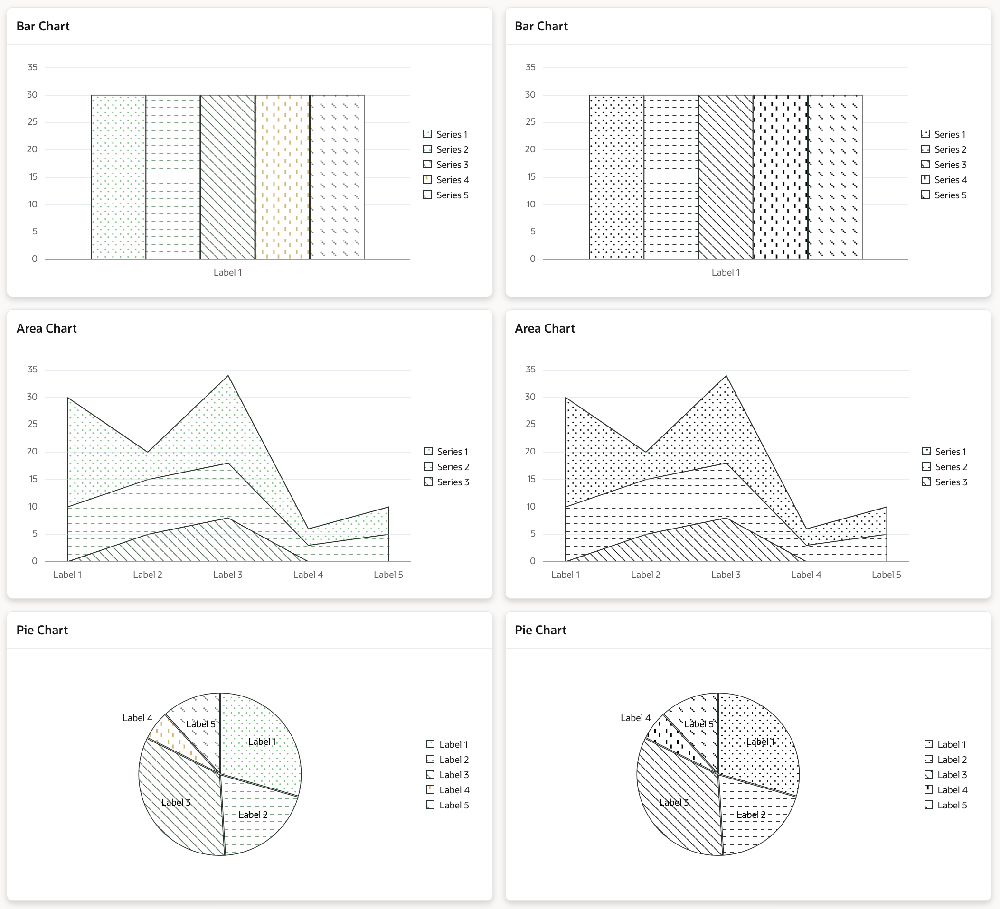

# Apex Chart Patterns

## About
Welcome to the demo application for apex-chart-patterns!
This tool enhances your Oracle APEX charts by allowing you to easily add custom patterns with a simple JavaScript function. 
Whether you want minimalistic thin lines or bold, thick patterns, our solution has got you covered. 

<div  style="float: left"><p  align="center">

</p></div>

## Minimal Chart Patterns
### Colorful
<div  style="float: left"><p  align="center">

</p></div>

### Black and white
<div  style="float: left"><p  align="center">

</p></div>

## Bold Chart Patterns
### Colorful
<div  style="float: left"><p  align="center">

</p></div>

### Black and white
<div  style="float: left"><p  align="center">

</p></div>

## How to use
1. Download the `apex-chart-patterns.js` file from the `dist` folder.
2. Upload the file to your Oracle APEX application static files.
3. Add the file to the `File URLs` section in your application settings or page you want to use it on.
4. Add the following code to the `Initialization JavaScript Function` section in your chart region:
```javascript
function(options) {
  //color options are 'minimal-color', 'minimal-bw', 'bold-color', 'bold-bw'
  var newOptions = addPatterns(options,'minimal-color'); 
  return newOptions;
}
```
5. Replace `'color'` with `'bw'` if you want to use black and white patterns.
6. Enjoy your new chart patterns!

## Demo Application
You can find the demo application [here](https://apex.oracle.com/pls/apex/r/pretius/apex-chart-patterns).

